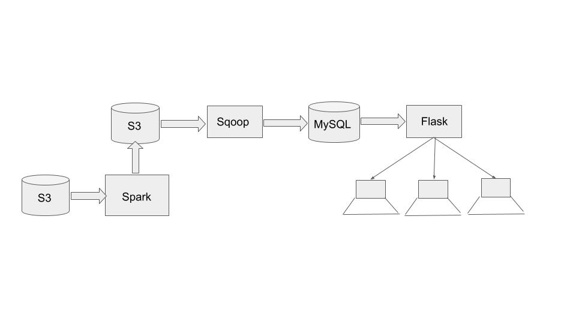

# US Census Data Analytics
The main idea behind this project is as follows -

Using US Census and local business data calculate various metrics that will help large businesses find most suitable locations to expand their operations. These metrics can also be used by anyone who is looking to start a new business. 

# Purpose and Use Cases
Often businesses are looking for opportunities to expand their operations and grow top line as well as bottom line. If a business is a chain of restaurants or stores one of the options to grow for them is to add new locations. But adding a new location can be an expensive endeavor. The business should carefully evaluate potential opportunities available in the new location. They need to know whether there would be enough demand for their services or products and also the people living in the area have sufficient purchasing power. To evaluate the potential of an area for their business they need to have access to the demographics, income levels of people and many other things. If they also have access to other businesses currently operating in the area they can assess the level of competition and it can validate their proposal to expand in the area. 

For every city in the US this project calculates various metrics such as - 

Gender distribution

Population distribution by age group

Household income levels

Housing units statistics

.

.

.

# Technologies 
Amazon S3

Apache Spark

Python, SparkSQL

Apache Sqoop

MySQL

WebUI (HTML, CSS, JQuery)

# Proposed Architecture

